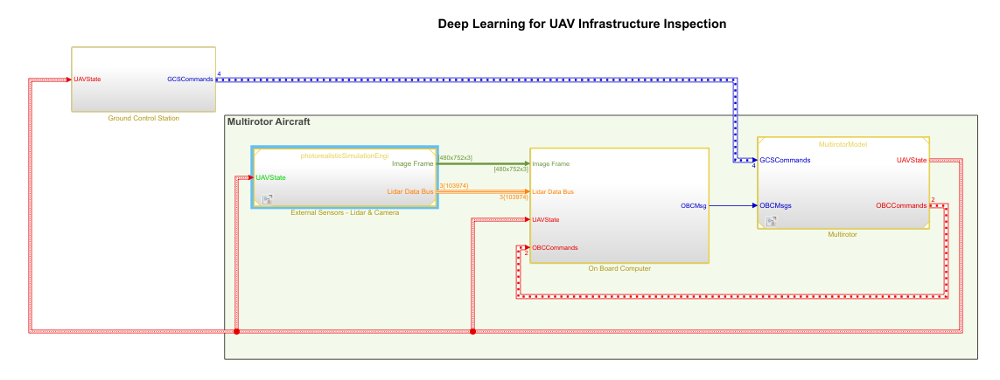
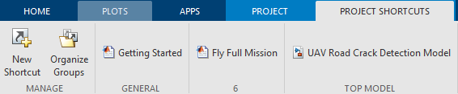
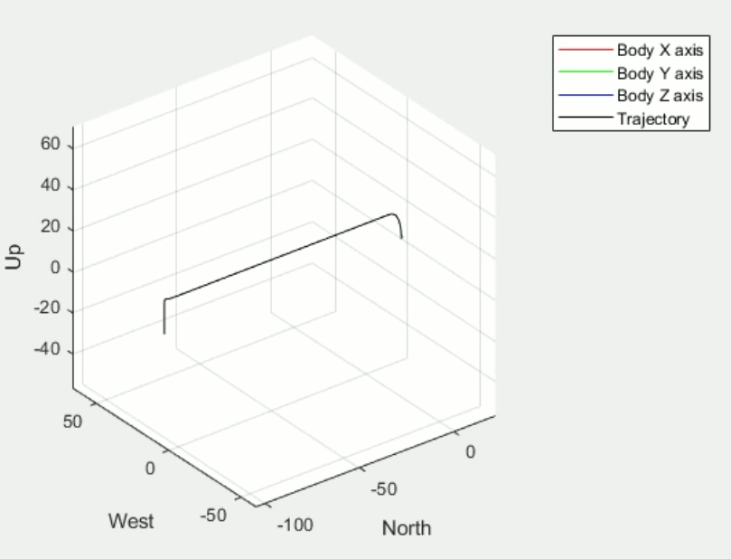
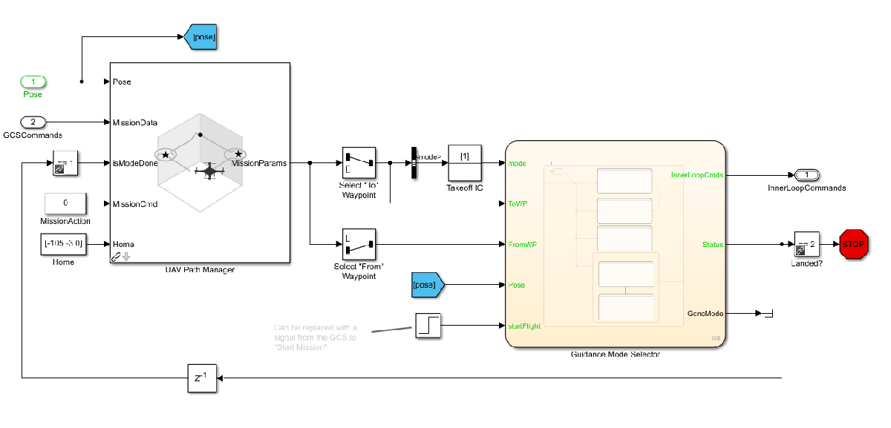
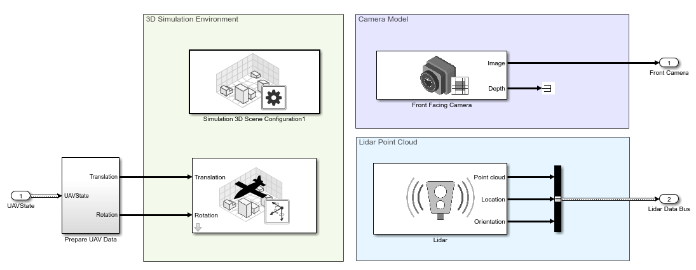
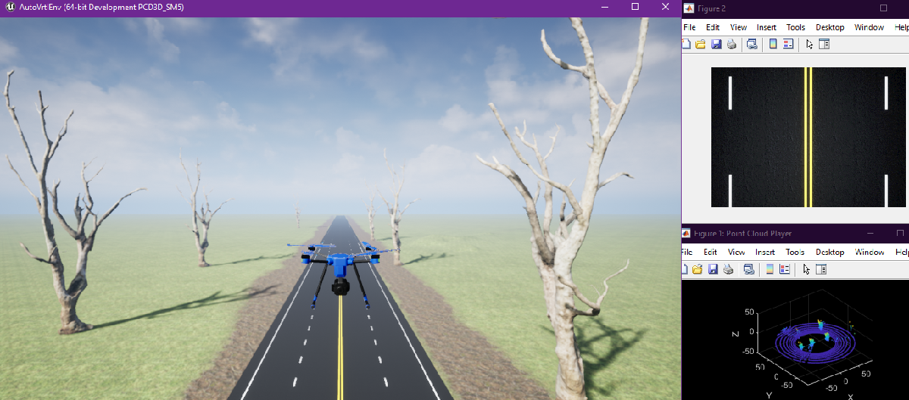
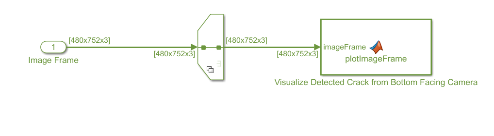
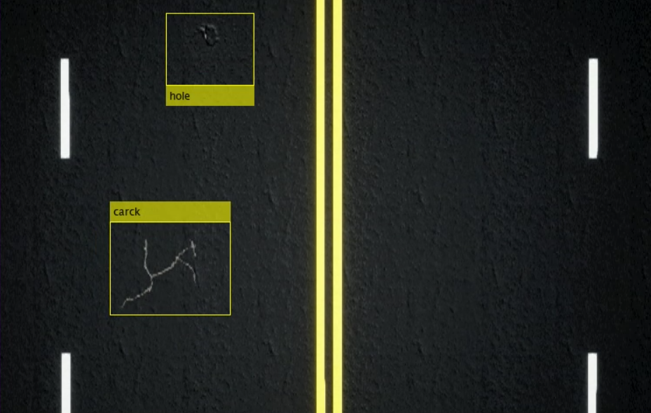
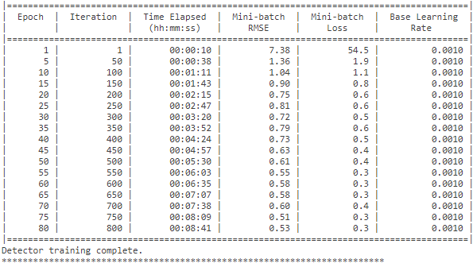

# **Deep Learning for UAV Infrastructure Inspection**

 MathWorks' Excellence in Innovation [Project 187](https://github.com/mathworks/MathWorks-Excellence-in-Innovation)

## UAV Road Crack Detection


## Open the Project

To get started, open the example live script and access the supporting files by clicking **Open Live Script** in the documentation

  

Then, open the Simulink™ project file. 

```matlab:Code
prj = openProject('uavRoadCrackDetection.prj');

```



  
## Model Architecture and Conventions

The top model consists of the following subsystems and model references:

   1.  **Ground Control Station:**  Used to control and monitor the aircraft while in-flight. 
   1.  **External Sensors - Lidar \& Camera:** Photorealistic simulation environment. These produce Lidar readings from the environment as the aircraft flies through it. 
   1.  **On Board Computer:** Used to implement algorithms meant to run in an on-board computer independent from the Autopilot. 
   1.  **Multirotor: **Includes a low-fidelity and mid-fidelity multicopter mode, a flight controller including its guidance logic.    

The model's design data is contained in a Simulink™ data dictionary in the **data** folder (`uavRoadCrackDetection.sldd`). 

## Following Example Steps

Use the **Project Shortcuts** to step through the example. Each shortcut sets up the required variables for the project.



## 1. Getting Started

Click the **Getting Started** project shortcut, which sets up the model for a four-waypoint mission using a low-fidelity multirotor plant model. **Run** the `uavRoadCrackDetection` model, which shows the multirotor takeoff, fly, and land in a 3-D plot.  



The model uses **UAV Path Manager** block to determine which is the active waypoint throughout the flight. The active waypoint is passed into the **Guidance Mode Selector** Stateflow™ chart to generate the necessary inner loop control commands.



  
## 2. Photorealistic Simulation

To increase the fidelity of the environment, click the **Fly Full Mission** shortcut, which places the aircraft in a more realistic world to fly through. Before running this model, you need to configure the Simulation 3D scene. Download Unreal Engine Executable from this [Link](https://drive.google.com/file/d/1CNQOKLkkonQ7msBWOEhFLV7BjNH8jpoc/view?usp=sharing) and unzip it. Then follow given instructions below.

   1.  In the [Simulation 3D Scene Configuration](https://in.mathworks.com/help/uav/ref/simulation3dsceneconfiguration.html) block of Simulink model, set the **Scene source** parameter to `Unreal Executable`. 
   1.  Browse for the full path to the file by using backslashes. For example: `C:\Local\AutoVrtlEnv\WindowsNoEditor\AutoVrtlEnv.exe` 
   1.  Set the **Scene** parameter to the name of a scene from within the executable file. For example:` /Game/Maps/HwStrght` 
   1.  Run the simulation. 

  

Notice as the aircraft flies the mission the lidar point clouds update and an image from the bottom-facing camera is shown.



  

Using Yolov2 Trained Model, System detect the crack and hole from live video stream from the drone



  

  

When you are done, close the project file. 

```matlab:Code
close(prj);
```

## DeepLearning Model
  

This project used **YoloV2** model architecture for this detecting crack and holes in the Highway Road. We used custom dataset, which is present in Images folder we labeled using ImageLabeller Matlab app, Labelled session file present in root directory **labelledImagesData.mat.**

Trained Model parameter stored in root directory of this project **detectorYolo2.mat**

For YoloV2 custom training open **YoloTrain.mlx** for more details.



## Legal Notice

This Project is made available under the MIT license found in the ``LICENSE`` file. An MIT license is one of several public copyright licenses that enable the free distribution of otherwise copyrighted work.
